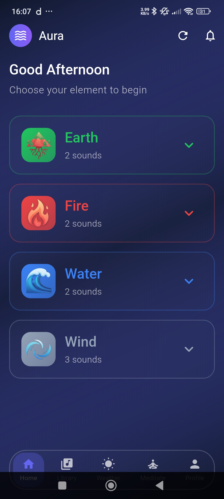
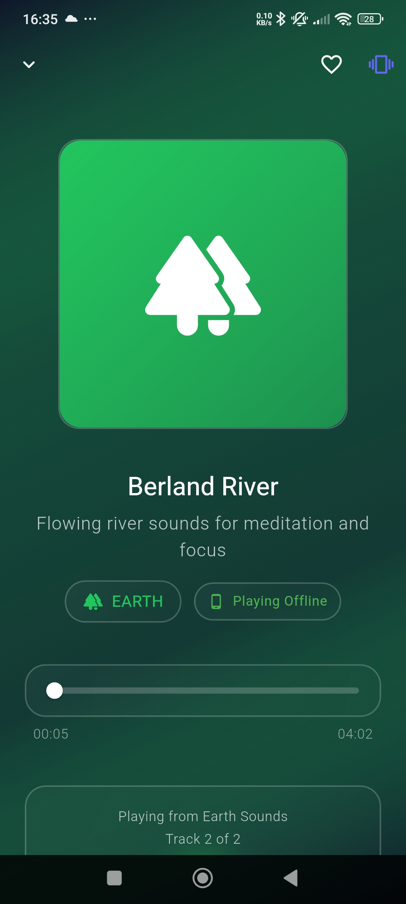
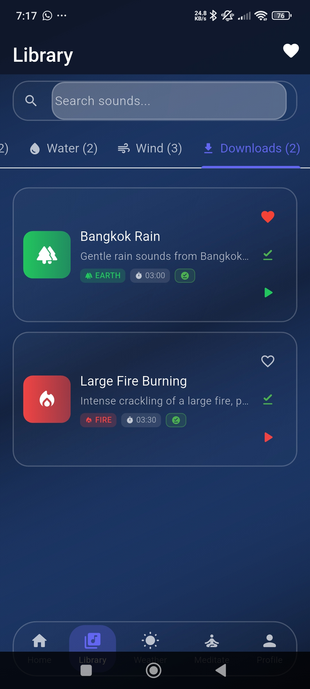
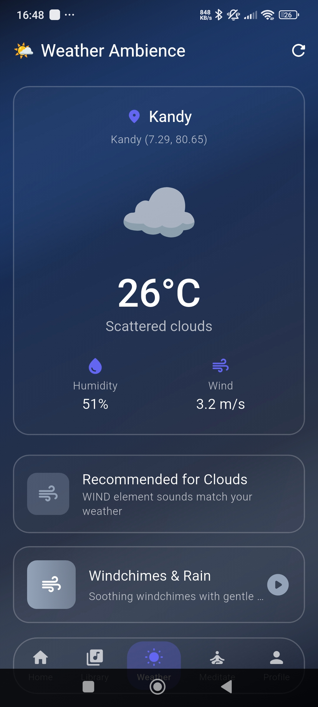
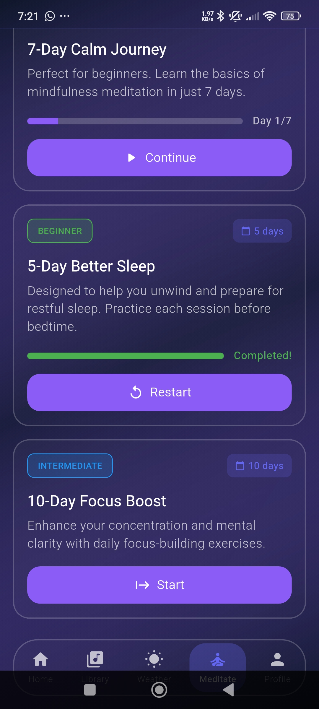
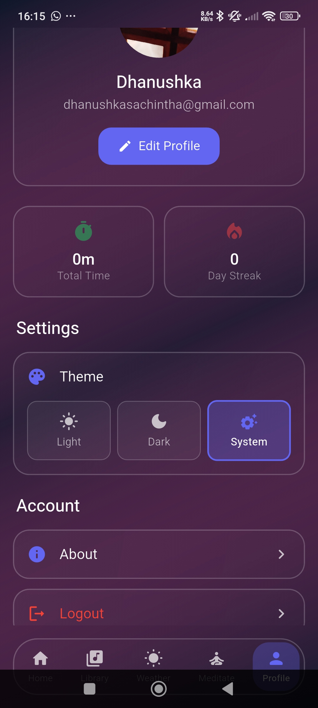
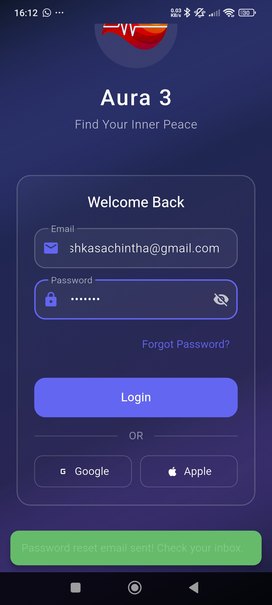

# 🌊 Aura 3 - ASMR & Meditation App

<div align="center">


**Find Your Inner Peace with Liquid Glass Design**

[](https://flutter.dev)
[](https://firebase.google.com)
[](LICENSE)

[Features](#-features) • [Screenshots](#-screenshots) • [Installation](#-installation) • [Usage](#-usage) • [Contributing](#-contributing)

</div>

---

## 📖 About

Aura 3 is a beautifully designed ASMR and meditation app built with Flutter, featuring a stunning liquid glass morphism UI. Experience tranquility through curated soundscapes from the four elements: Earth, Fire, Water, and Wind.

### ✨ Key Highlights

- 🎨 **Liquid Glass Design** - Modern glassmorphism UI with smooth animations
- 🌍 **Elemental Soundscapes** - Curated sounds across Earth, Fire, Water, and Wind
- 🌤️ **Weather Ambience** - AI-powered sound recommendations based on your local weather
- 🧘 **Guided Meditation** - Multi-day meditation programs for all levels
- 📱 **Shake to Skip** - Intuitive gesture controls using device sensors
- 💾 **Offline Playback** - Download sounds for offline listening
- 🔥 **Firebase Integration** - Cloud-based storage and authentication
- 📊 **Progress Tracking** - Monitor your meditation journey and listening stats

---

## 🎯 Features

### 🎵 Audio Experience
- **High-Quality Sounds** - Premium ASMR and nature sounds
- **Element-Based Library** - Organize sounds by Earth, Fire, Water, Wind
- **Custom Playlists** - Create and manage your own collections
- **Download Manager** - Save sounds for offline access
- **Smart Audio Player** - Automatic local/cloud playback switching
- **Shake to Skip** - Skip tracks by shaking your phone

### 🌤️ Weather Ambience (NEW!)
- **Location-Based Recommendations** - Get sound suggestions based on your current weather
- **Real-time Weather Data** - Integrated with OpenWeatherMap API
- **Smart Element Matching** - Rain suggests Water sounds, Clear skies suggest Fire sounds, etc.
- **Weather Details** - View temperature, humidity, wind speed, and more
- **One-Tap Playback** - Instantly play recommended sounds for your weather

### 🧘‍♀️ Meditation Programs
- **7-Day Calm Journey** - Perfect for beginners
- **5-Day Better Sleep** - Evening wind-down program
- **10-Day Focus Boost** - Enhance concentration
- **3-Day Stress Relief** - Quick relief for challenging times
- **Progress Tracking** - Monitor your meditation streak

### 👤 User Experience
- **Beautiful Glassmorphism UI** - Liquid glass design with smooth animations
- **Dark/Light Theme** - Choose your preferred appearance
- **Google Sign-In** - Quick and secure authentication
- **Profile Customization** - Upload profile pictures, track stats
- **Favorites System** - Quick access to your preferred sounds
- **Responsive Design** - Optimized for both portrait and landscape modes

### 📊 Statistics & Tracking
- **Listening Time** - Track total meditation hours
- **Daily Streaks** - Maintain your meditation consistency
- **Recently Played** - Quick access to recent sounds
- **Download Stats** - Monitor offline storage usage

---

## 🖼️ Screenshots

<div align="center">

| Home Screen | Player | Library | Weather |
|:-----------:|:------:|:-------:|:-------:|
|  |  |  |  |

| Meditation | Profile | Downloads | Login |
|:----------:|:-------:|:---------:|:-----:|
|  |  |  |  |

</div>

> **Note:** Add actual screenshots to the `screenshots/` directory

---

## 🚀 Installation

### Prerequisites

- Flutter SDK (3.10.0 or higher)
- Dart SDK (3.10.0 or higher)
- Android Studio / Xcode
- Firebase account (for backend services)
- Git

### Setup Instructions

1. **Clone the repository**
```bash
git clone https://github.com/Dhanu45-sketch/aura3.git
cd aura3
```

2. **Install dependencies**
```bash
flutter pub get
```

3. **Firebase Setup**
   - Create a new Firebase project at [Firebase Console](https://console.firebase.google.com)
   - Enable Authentication (Email/Password and Google Sign-In)
   - Enable Cloud Firestore
   - Enable Firebase Storage
   - Download and replace configuration files:
     - `android/app/google-services.json`
     - Update `lib/firebase_options.dart`
   

4. **Android Permissions**
   
   The following permissions are already configured in `AndroidManifest.xml`:
   - Location (for Weather feature)
   - Camera & Storage (for profile pictures)
   - Sensors (for shake detection)
   - Internet (for streaming)

5. **Configure Firebase Storage**
   - Upload sound files to Firebase Storage following this structure:
   ```
   sounds/
   ├── earth/
   ├── fire/
   ├── water/
   └── wind/
   ```
   - Update `assets/data/sounds.json` with correct Firebase Storage paths

6. **Update sounds.json URL** (Optional)
   - If hosting sounds.json externally, update the URL in:
   ```dart
   // lib/core/services/sound_service.dart
   static const String externalJsonUrl = 'YOUR_GITHUB_RAW_URL';
   ```

7. **Run the app**
```bash
# For Android (Tested & Recommended)
flutter run

# For other platforms (Untested)
# flutter run -d ios
# flutter run -d chrome
# flutter run -d windows
```

---

## 📱 Platform Support

| Platform | Status | Notes |
|----------|--------|-------|
| 🤖 Android | ✅ Fully Tested | Min SDK: 21 (Android 5.0) |
| 🍎 iOS | ⚠️ Not Tested | Should work but needs testing & configuration |
| 🌐 Web | ⚠️ Partial | Core functionality works, needs testing |
| 🖥️ macOS | ⚠️ Not Tested | Should work but needs testing |
| 🪟 Windows | ⚠️ Not Tested | Should work but needs testing |
| 🐧 Linux | ❌ Not Configured | Can be configured via FlutterFire CLI |

---

## 🏗️ Architecture

### Project Structure
```
lib/
├── core/
│   ├── models/          # Data models (Sound, Playlist, MeditationProgram, WeatherData)
│   ├── services/        # Business logic services
│   ├── theme/           # App theming (glassmorphism)
│   └── widgets/         # Reusable glass UI components
├── features/
│   ├── auth/            # Authentication (Email & Google Sign-In)
│   ├── home/            # Home screen with elemental soundscapes
│   ├── library/         # Sound library & downloads
│   ├── meditation/      # Meditation programs & tracking
│   ├── player/          # Audio player with shake detection
│   ├── profile/         # User profile & statistics
│   └── weather/         # Weather Ambience (NEW!)
└── main.dart            # App entry point
```

### Key Technologies

- **State Management**: Provider
- **Audio Playback**: just_audio
- **Authentication**: Firebase Auth (Email & Google)
- **Storage**: Firebase Storage & shared_preferences
- **Location Services**: geolocator & geocoding
- **Weather API**: OpenWeatherMap API integration
- **Sensors**: sensors_plus (shake detection)
- **Animations**: flutter_animate
- **UI**: Custom glassmorphism components
- **Network**: connectivity_plus & http

---

## 🔧 Configuration

### Environment Variables

The app uses OpenWeatherMap API for weather data. The API key is currently hardcoded in:
```dart
// lib/features/weather/services/weather_service.dart
static const String _apiKey = 'YOUR_API_KEY';
```

**To get your own API key:**
1. Sign up at [OpenWeatherMap](https://openweathermap.org/api)
2. Get a free API key
3. Replace the API key in `weather_service.dart`

> **Note:** The current API key is included for testing but may have usage limits.

### Customization

#### Update App Colors
Edit `lib/core/theme/app_colors.dart` to customize the color scheme.

#### Add New Sounds
1. Upload audio files to Firebase Storage
2. Update `assets/data/sounds.json`:
```json
{
  "id": "earth_003",
  "title": "Forest Rain",
  "element": "earth",
  "description": "Gentle forest rain",
  "durationSeconds": 180,
  "firebaseStoragePath": "sounds/earth/forest-rain.wav",
  "tags": ["rain", "forest", "nature"],
  "isPremium": false,
  "fileSize": "5.2 MB",
  "format": "WAV"
}
```

#### Add Meditation Programs
Edit `assets/data/meditation_programs.json` to add new meditation programs.

---

## 🎮 Usage

### For Users

1. **Sign Up/Login** - Create an account or sign in with Google
2. **Browse Sounds** - Explore sounds by element or search
3. **Weather Ambience** - Tap the Weather tab to get personalized sound recommendations
4. **Play Audio** - Tap any sound to start playing
5. **Download for Offline** - Download sounds to play without internet
6. **Start Meditation** - Choose a meditation program and begin your journey
7. **Track Progress** - View your stats in the Profile section

### Weather Ambience Feature

The Weather Ambience screen automatically:
- Detects your current location
- Fetches real-time weather data
- Recommends sounds based on weather conditions:
  - **Rainy/Stormy** → Water element sounds
  - **Clear/Sunny** → Fire element sounds
  - **Cloudy/Foggy** → Wind element sounds
  - **Snowy** → Earth element sounds

### Shake to Skip Feature

Enable shake detection in the player screen to skip tracks by shaking your phone. Perfect for when your hands are busy during meditation!

---

## 🛠️ Development

### Running Tests
```bash
flutter test
```

### Build for Production

**Android (Tested)**
```bash
flutter build apk --release
flutter build appbundle --release
```

**Other Platforms (Untested)**
```bash
# iOS - Requires Mac with Xcode
# flutter build ios --release

# Web - May need additional testing
# flutter build web --release
```

---

## 🤝 Contributing

We welcome contributions! Here's how you can help:

1. **Fork the repository**
2. **Create a feature branch**
   ```bash
   git checkout -b feature/AmazingFeature
   ```
3. **Commit your changes**
   ```bash
   git commit -m 'Add some AmazingFeature'
   ```
4. **Push to the branch**
   ```bash
   git push origin feature/AmazingFeature
   ```
5. **Open a Pull Request**

### Contribution Guidelines

- Follow the existing code style
- Write clear commit messages
- Add tests for new features
- Update documentation as needed
- Ensure all tests pass before submitting PR

---

## 🐛 Known Issues

- [ ] Only tested on Android - other platforms need testing
- [ ] iOS: Not configured or tested
- [ ] Web: Audio streaming may have delays on slow connections
- [ ] Android: Shake detection sensitivity varies by device
- [ ] Weather: First-time users must grant location permissions

See [Issues](https://github.com/Dhanu45-sketch/aura3/issues) for a complete list.

---

## 📝 Changelog

### Version 3.0.0 (Current)
- ✨ Complete app redesign with glassmorphism UI
- 🔥 Firebase integration for cloud storage
- 🌤️ **Weather Ambience feature with location-based recommendations**
- 🧘 Added meditation programs with progress tracking
- 📥 Offline download manager
- 📱 Shake to skip feature using accelerometer
- 📊 Statistics and progress tracking
- 🎨 Responsive design for landscape/portrait modes
- 🔐 Google Sign-In authentication
- 💾 Smart local/cloud audio playback switching

---

## 📄 License

This project is licensed under the MIT License - see the [LICENSE](LICENSE) file for details.

---

## 👥 Authors

- **Your Name** - *Initial work* - [YourGitHub](https://github.com/Dhanu45-sketch)

---

## 🙏 Acknowledgments

- **OpenWeatherMap**: Weather data API
- **Sound Credits**: Thanks to all the creators on Freesound.org
- **Icons**: Lucide Icons & Material Design Icons
- **Inspiration**: Various meditation apps and ASMR communities
- **Flutter Community**: For amazing packages and support

---

## 📞 Contact & Support

- **Email**: dhanushkasachintha.gmail@example.com


---

## 🌟 Star History

[](https://star-history.com/#Dhanu45-sketch/aura3&Date)

---

<div align="center">

**Made with ❤️ and Flutter**

If you find this project helpful, please give it a ⭐!

[⬆ Back to Top](#-aura-3---asmr--meditation-app)

</div>
